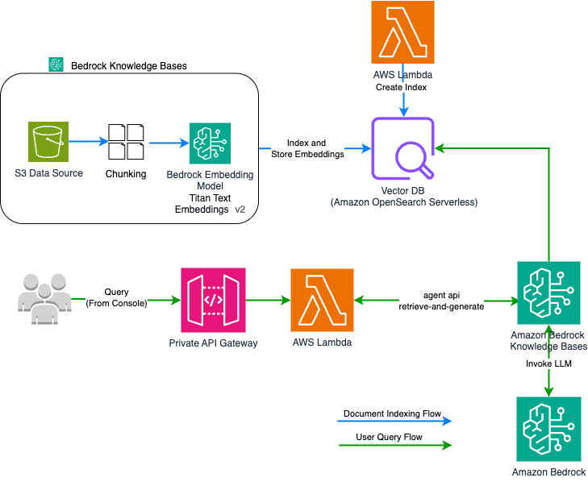
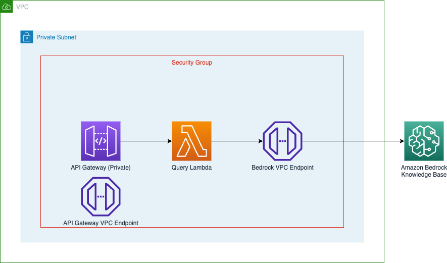

 # CDK Python Code to deploy RAG with Bedrock Knowledge Bases and OpenSearch Serverless In GovCloud
 ## Table of Contents
 - [Solution Overview](#solution-overview)
 - [Architecture Diagram](#architecture-diagram)
 - [Prerequisites](#prerequisites)
 - [Installation](#installation)
 - [Setup](#setup)
 - [Deployment](#deployment)
 - [Testing](#testing)
 - [Clean Up](#clean-up)

## Sample Solution Overview
This repository enables you to set up a secure chatbot using Amazon Bedrock in an AWS GovCloud account. The solution implements a Retrieval-Augmented Generation (RAG) pattern using Amazon Bedrock Knowledge Bases and OpenSearch Serverless.

The chatbot data flow follows this secure path:
1. Client requests are sent to the Private API Gateway through the VPC Endpoint
2. API Gateway forwards requests to the Lambda function
3. Lambda queries the Bedrock Knowledge Base through the Bedrock VPC Endpoint
4. Responses are returned through the same secure path

This architecture ensures that all data and API calls remain within your AWS network boundary, providing enhanced security for sensitive information and compliance with GovCloud requirements.

## Prerequisites

Before deploying this solution, ensure you have the following:

1. **AWS Account Access**:
   - An AWS GovCloud account with required IAM permissions
   - AWS CLI configured with appropriate credentials

2. **Amazon Bedrock Access**:
   - Access to Amazon Bedrock service in your region
   - Model access granted for the foundation models to be used in the demo

3. **Development Environment**:
   - Python 3.11 or later
   - Node.js 14.x or later (for AWS CDK)
   - AWS CDK v2 installed (`npm install -g aws-cdk`)

6. **S3 Bucket**:
   - An existing S3 bucket for document storage or permissions to create a new one
   - Sample documents to upload (PDF, TXT, or other supported formats)

 ## Architecture Diagram
<br/>


 ## Installation

 ### Setup
 1. Clone the GitHub repository containing the solution files:
    ```
    git clone <git repository>
    ```

 2. Navigate to the solution directory:
    ```
    cd bedrock-apps
    ```

 3. Create and activate the virtual environment:
    ```
    python3 -m venv .venv
    source .venv/bin/activate
    ```
    Note: The activation of the virtual environment differs based on the operating system; refer to the AWS CDK workshop for activating in other environments.

 4. Install the required dependencies:
    ```
    pip install -r requirements-dev.txt
    ```

 5. Export your AWS credentials for a role or user with necessary permissions for CDK deployment:
    ```
    export AWS_REGION="<region>"
    export AWS_ACCESS_KEY_ID="<access-key>"
    export AWS_SECRET_ACCESS_KEY="<secret-key>"
    ```

 6. If you're deploying the AWS CDK for the first time, bootstrap your environment:
    ```
    cdk bootstrap aws://ACCOUNT-NUMBER/REGION
    ```
    - [Bootstrap documentation](https://docs.aws.amazon.com/cdk/v2/guide/ref-cli-cmd-bootstrap.html)
    - [Troubleshooting](https://docs.aws.amazon.com/cdk/v2/guide/bootstrapping-troubleshoot.html)

 ### Deployment
 1. View and update configurations in `config.py`:
    - Go to Amazon Bedrock console and enable the models
    - Update the `S3_BUCKET_NAME` in `config.py` to the bucket name where your files are stored

 2. Synthesize the CloudFormation template: [cdk synthesize developer guide](https://docs.aws.amazon.com/cdk/v2/guide/ref-cli-cmd-synth.html)
    ```
    cdk synth
    ```

 3. Deploy the stacks in the following order: [cdk deploy developer guide](https://docs.aws.amazon.com/cdk/v2/guide/ref-cli-cmd-deploy.html)
    ```
    cdk deploy lambdalayerstack
    cdk deploy aossstack
    cdk deploy knowledgebasestack
    cdk deploy apistack
    ```

 4. Once deployment is finished, you can see these deployed stacks in the AWS CloudFormation console.

 ### Testing
 1. On the Amazon Bedrock console, choose Knowledge bases in the navigation page.
 2. Select the knowledge base you created.
 3. Choose Sync to initiate the data ingestion job.
 4. After the data ingestion job is complete, choose the desired foundation model to use for retrieval and generation.This requires model access to be granted in Amazon Bedrock before using.[AWS Documenation to modify model access in Amazon Bedrock](https://docs.aws.amazon.com/bedrock/latest/userguide/model-access-modify.html) 
 5. Start querying your data using natural language queries. [AWS Documentation to test your knowledge base](https://docs.aws.amazon.com/bedrock/latest/userguide/knowledge-base-test.html)

 Additional testing options:
 - From Lambda, navigate to `apistack-Query...` lambda and test with this Event JSON:
   ```json
   {
     "body": "{\"question\":\"<your question>\"}"
   }
   ```
 - From Privae API Gateway in AWS Console, execute "POST" on the resource `/question` with this request body:
   ```json
   {"question": "<your question>"}
   ```

 ### Clean Up
 To avoid incurring future charges on your AWS account:

 1. Delete all files within the provisioned S3 bucket.
 2. Delete the CloudFormation stacks using one of these methods:
    
    Option 1: Delete all stacks at once:
    ```
    cdk destroy --all
    ```
    
    Option 2: Delete stacks individually in reverse order:
    ```
    cdk destroy apistack
    cdk destroy knowledgebasestack
    cdk destroy aossstack
    cdk destroy lambdalayerstack
    ```
## Security

See [CONTRIBUTING](CONTRIBUTING.md#security-issue-notifications) for more information.

## License

This library is licensed under the MIT-0 License. See the LICENSE file.